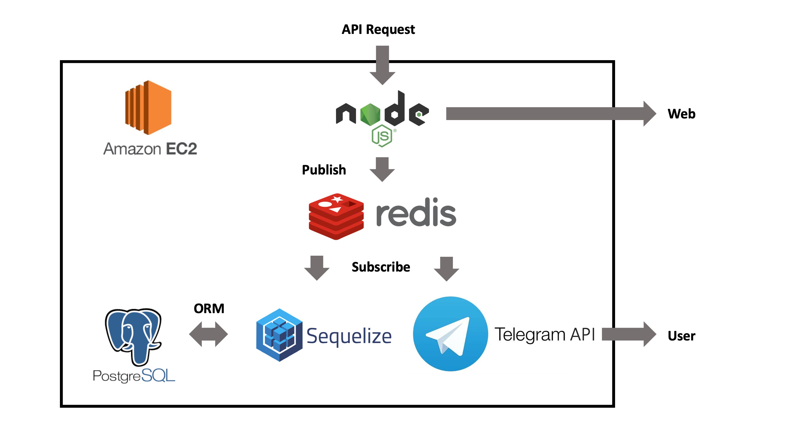

# 프리자, 냉장고를 부탁해!

## 집에 주스가 남아있나..?
냉장고에 남은 재료를 기억하고 있기에는 너무 바쁜 당신입니다. 프리자는 냉장고 안의 재료가 부족해지면 적절한 타이밍에 알려줍니다. 이제부턴 장 볼 때 무엇이 부족한지 고민할 필요 없습니다. 프리자가 알려드릴게요!
## 시스템 구성
프리자는 다음의 기술을 사용합니다.  
  

+ 센서  
1. 냉장고 안에 설치된 로드셀 위에 주스(예를 들어)가 있습니다.
2. 주스를 마십니다. 
2. 무게 변화로 인해서 로드셀에서 보내는 전압이 변경됩니다.
3. 미약한 변화이기 때문에 증폭기(HX711)에서 증폭시킵니다. 
4. 증폭된 신호를 NodeMCU로 보냅니다.
5. NodeMCU에서 AWS로 받아온 신호를 전송합니다.

+ 서버
1. 받아온 데이터를 MySQL로 구성한 DB에 저장합니다.
2. 주스가 필요한지 아닌지 판단합니다.
3. 주스가 모자라다고 판단하면 유저에게 주스가 필요하다는 신호를 보냅니다.

+ 클라이언트
1. 주스가 모자라다는 알림을 받습니다.

## 데이터 분석
무게 센서를 통해 재료의 남은 양을 알 수 있습니다. 수집된 무게 데이터는 와이파이를 통해 서버로 전송되고 서버에서는 남은 양에 따라 부족한지 여부를 판단합니다. 장을 볼 때가 됐다고 판단하면 프리자는 사용자에게 이메일, 혹은 어플리케이션 푸쉬 알림으로 사용자에게 알립니다. 다음과 같은 메시지로 말이죠.  

