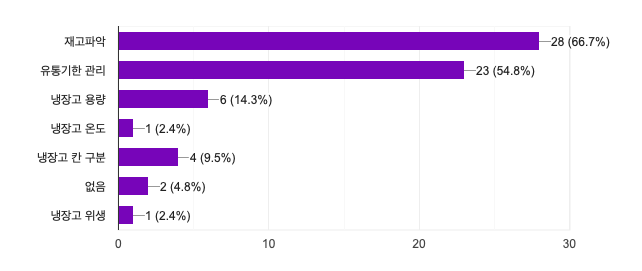

# 프리자, 냉장고를 부탁해!

## 냉장고 사용에 불편함이 있으신가요?
총 42명의 응답자 중 절반이 넘는 사람들이 냉장고 속 재료가 얼마나 남았는지 파악하는데 어려움이 있다고 대답하였습니다. 
  
냉장고에 남은 재료를 기억하고 있기에는 너무 바쁜 당신입니다. 보다 중요한 일에 집중할 수 있도록, 프리자는 냉장고 안의 재료가 부족해지면 적절한 타이밍에 알려줍니다. 이제부턴 장 볼 때 무엇이 부족한지 고민할 필요 없습니다. 프리자가 알려드릴게요!

## 시스템 구성
프리자의 기술 개념도입니다.  
  

### 센서 모듈  
프리자의 센서 모듈은 로드셀과 증폭기, 그리고 ESP8266으로 구성됩니다. 냉장고 안에 설치된 로드셀이 식재료의 변화량을 추적합니다. 로드셀에 의한 전압 변화는 미약하기 때문에 HX711 증폭기를 이용하여 추적이 용이하도록 합니다. 증폭기를 통해 ESP8266 WiFi 모듈에 입력된 신호는 AWS EC2로 구축된 서버로 전송됩니다.

### 서버
EC2는 실시간으로 사용자의 식재료를 모니터링합니다. 초기 설정은 지정된 임계치 이하로 떨어졌을 때 알림을 주는 방식이지만, 사용자의 이용 패턴을 분석하여 보다 적절한 알림 타이밍을 맞출 수 있도록 합니다. 웹 서버는 NodeJS로 구성하고 사용자의 데이터베이스 관리는 MySQL을 이용합니다. 모자라다는 알림은 이메일, 혹은 어플리케이션 푸쉬 알림으로 보내도록 합니다.

### 클라이언트
냉장고 안에 재료가 부족해 장을 볼 때가 됐다고 판단하면 프리자는 사용자에게 이메일, 혹은 어플리케이션 푸쉬 알림으로 사용자에게 알립니다. 다음과 같은 메시지로 말이죠.  

## 추가 기능
프리자는 냉장고의 재료가 부족한지 알림을 주기 위한 서비스로 기획되었습니다. 차후에는 이를 넘어 재료들의 유통기한까지 스마트하게 관리해주는 서비스도 구상 중입니다. 