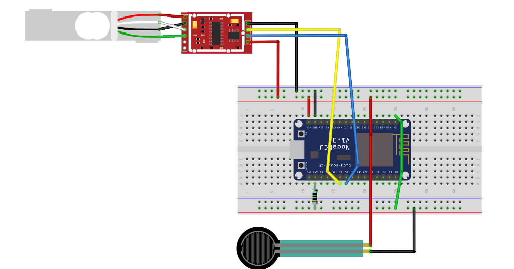
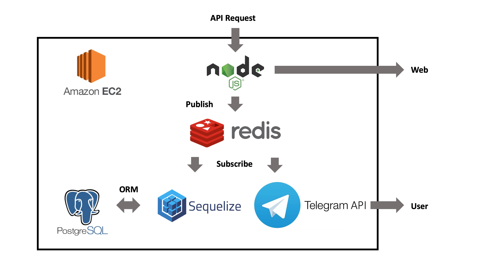

# 프리자, 냉장고를 부탁해!

## 냉장고 사용에 불편함이 있으신가요?
총 42명의 응답자 중 절반이 넘는 사람들이 냉장고 속 재료가 얼마나 남았는지 파악하는데 어려움이 있다고 대답하였습니다. 
  
냉장고에 남은 재료를 기억하고 있기에는 너무 바쁜 당신입니다. 보다 중요한 일에 집중할 수 있도록, 프리자는 냉장고 안의 재료가 부족해지면 적절한 타이밍에 알려줍니다. 이제부턴 장 볼 때 무엇이 부족한지 고민할 필요 없습니다. 프리자가 알려드릴게요!

## 시스템 구성
프리자는 크게 센서 모듈과 서버로 구성되며 Telegram bot을 이용하여 사용자에게 푸쉬 알림을 줍니다.  

### 센서 모듈  

로드셀의 아날로그 출력을 HX711을 이용하여 증폭 및 디지털 신호 변환을 합니다. 여기서 frs01ce가 안날로그 신호를 직접 받으며, 이후 모든 디지털 신호는 ESP8266에 전달되어 처리됩니다.  

### 서버

위의 센서 모듈에서는 측정치를 JSON 형태로 HTTP를 통해 서버로 전송합니다. 서버는 받은 리퀘스트를 비동기로 처리하기 위하여 redis의 pub/sub 을 이용합니다.

측정치를 받은 웹서버 프로세스는 redis에 해당 데이터를 게시하며, 각 채널을 구독중인 개별적인 프로세스들은 데이터베이스에 추가, 데이터 분석, 푸쉬 알림 전송 판단 등을 합니다.  

### Telegram Bot
사용자는 다음과 같은 유머러스한 이미지를 통해서 재료가 부족하다고 전달 받습니다.  

 `호오 계란이 부족하군요!`  

## 추가 기능
프리자는 냉장고의 재료가 부족한지 알림을 주기 위한 서비스로 기획되었습니다. 차후에는 이를 넘어 재료들의 유통기한까지 스마트하게 관리해주는 서비스가 기획중에 있습니다.